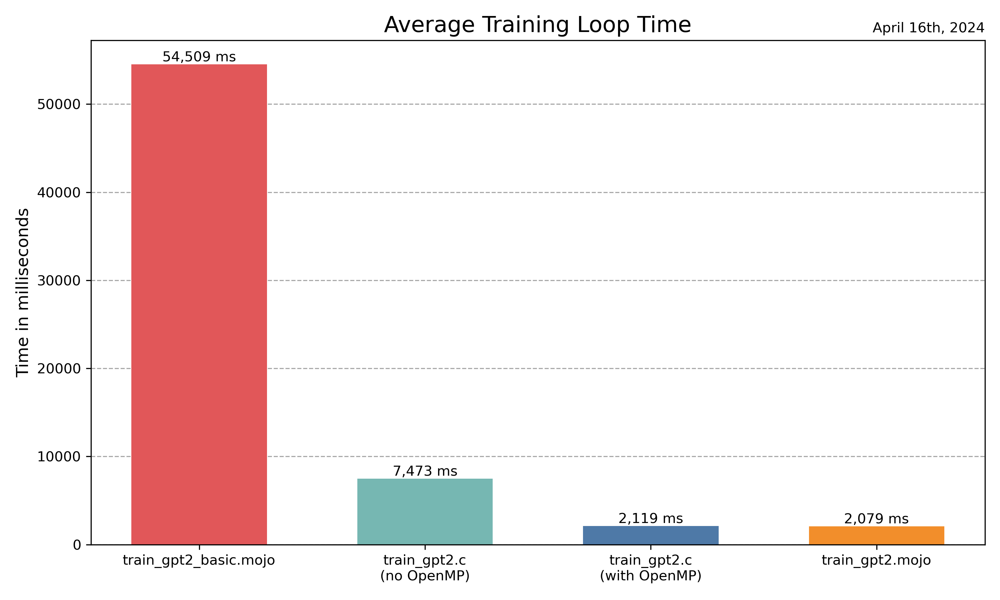

# llm.🔥

This project is a port of Andrej Karpathy's [llm.c](https://github.com/karpathy/llm.c) to [Mojo](https://docs.modular.com/mojo), currently in beta. Visit [llm.c](https://github.com/karpathy/llm.c) for a detailed explanation of the original project.

Please note that this repository has not yet been updated to Mojo version 24.5 because the following issue is only resolved in the nightly release but not in the stable release of Mojo 24.5: [parallelize won't work with local variables](https://github.com/modularml/mojo/issues/3483)

## Implementation

- **train_gpt2_basic.mojo**: Basic port of train_gpt2.c to Mojo, which does not leverage Mojo's capabilities. Beyond the initial commit, we will not provide further updates for the 'train_gpt2_basic' version, except for necessary bug fixes.
- **train_gpt2.mojo**: Enhanced version utilizing Mojo's performance gems like vectorization and parallelization. Work in progress.

## Prerequisite

Before using llm.🔥 for the first time, please run the following preparatory commands:
  
```bash
pip install -r requirements
python prepro_tinyshakespeare.py  
python train_gpt2.py
```

## How to use

- Ensure that the [Magic](https://docs.modular.com/max/tutorials/magic) command line tool is installed by following the [Modular Docs](https://docs.modular.com/magic).

```bash
magic shell -e mojo-24-4
mojo train_gpt2.mojo
```

For a more detailed step-by-step guide including additional setup details and options, please refer to our [detailed usage instructions](./usage_instructions.md).

### Mojo 24.5 nightly

A initial version for the nightly release of Mojo 24.5 is now available for testing:

```bash
magic shell -e nightly
mojo train_gpt2_nightly.mojo
```

Please not that the nightly releases are often subject to breaking changes, so you may encounter issues when running ```train_gpt2_nightly.mojo```.

## Benchmarks

Basic benchmark results: (M2 MacBook Pro)

- Below are average training loop times, observed across the various implementations. Please note that these results are intended to provide a general comparison rather than precise, repeatable metrics.

- We are running the OpenMP-enabled train_gpt2.c with 64 threads.
  (`OMP_NUM_THREADS=64 ./train_gpt2`)

| Implementation             | Average Training Loop Time |
|----------------------------|----------------------------|
| train_gpt2.mojo            | 1819 ms                    |
| train_gpt2.c (with OpenMP) | 1849 ms                    |
| train_gpt2.c (no OpenMP)   | 7473 ms                    |
| train_gpt2_basic.mojo      | 54509 ms                   |



## Test

We ported `test_gpt2.c` from the original repository to Mojo to validate our port's functionality. For instructions on how to run this test and insights into the results it yields, please see our guide [here](./test.md).

## Development Roadmap

- **Implementation Improvement**: Enhance `train_gpt.mojo` to fully exploit Mojo's capabilities, including further optimization for speed and efficiency.
- **Following Changes of llm.c**: Regularly update the Mojo port to align with the latest improvements and changes made to `llm.c`.
- **Solid Benchmarks**: Develop comprehensive and reliable benchmarks to accurately measure performance improvements and compare them against other implementations.
  
## Changelog

- 2024.09.24
  - Switch to the [Magic](https://docs.modular.com/max/tutorials/magic) package management tool by Modular
- 2024.06.07
  - Update to Mojo 24.4
- 2024.05.04
  - Update to Mojo 24.3
  - Update llm.c changes
- 2024.04.20
  - Further optimization (utilizing unroll_factor of vectorize)
- 2024.04.19
  - test_gpt2.mojo added.
- 2024.04.18
  - Upgraded project status to Beta.
  - Further optimizations of train_gpt2.mojo.
- 2024.04.16
  - Vectorize parameter update
- 2024.04.15
  - Tokenizer Added - `train_gpt2.c` Update 2024.04.14
  - Bug fix `attention_backward`
- 2024.04.13
  - Initial repository setup and first commit.

## License

MIT
