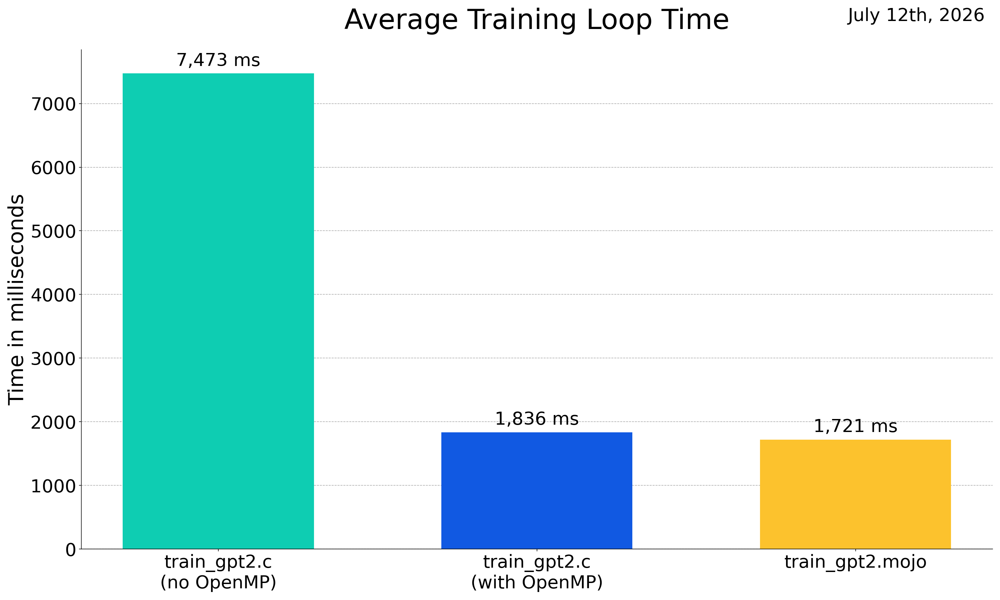

# llm.🔥

This project is a port of Andrej Karpathy's [llm.c](https://github.com/karpathy/llm.c) to [Mojo](https://mojolang.org), currently in beta. Visit [llm.c](https://github.com/karpathy/llm.c) for a detailed explanation of the original project.

> **Note**: We are preparing this repo for the upcoming Mojo 1.0 release — this is work in progress. It currently builds against the Mojo 1.0.0b2 beta.

## Prerequisite

Before using llm.🔥 for the first time, please run the following preparatory commands in a virtual environment:
  
```bash
python3 -m venv .venv
source .venv/bin/activate
pip install -r requirements.txt
python prepro_tinyshakespeare.py  
python train_gpt2.py
```

## How to use

### Step 1: Install Pixi

If you don't have it, install [pixi](https://pixi.sh/latest/):

```bash
curl -fsSL https://pixi.sh/install.sh | sh
```

### Step 2: Run the training program

Start the virtual environment and execute the training program:

```bash
pixi shell
mojo train_gpt2.mojo
```

> **Note**: The first time you run `pixi shell`, it will automatically install all necessary dependencies defined in `pixi.toml`.

For a more detailed step-by-step guide including additional setup details and options, please refer to our [detailed usage instructions](./usage_instructions.md).

## Benchmarks

Basic benchmark results: (M2 MacBook Pro)

- Below are average training loop times, observed across the various implementations. Please note that these results are intended to provide a general comparison rather than precise, repeatable metrics.

- We are running the OpenMP-enabled train_gpt2.c with 64 threads.
  (`OMP_NUM_THREADS=64 ./train_gpt2`)

| Implementation             | Average Training Loop Time |
|----------------------------|----------------------------|
| train_gpt2.mojo            | 1721 ms                    |
| train_gpt2.c (with OpenMP) | 1836 ms                    |
| train_gpt2.c (no OpenMP)   | 7473 ms                    |



## Test

We ported `test_gpt2.c` from the original repository to Mojo to validate our port's functionality. For instructions on how to run this test and insights into the results it yields, please see our guide [here](./test.md).

## Project Outlook

llm.🔥 began in 2024 as a response to Karpathy's then newly released [llm.c](https://github.com/karpathy/llm.c). Its purpose was to show that Mojo could implement the same low-level, C-style program — raw pointers, manual memory management — while matching its performance.

Sustained interest in the repo has kept us updating it to track new Mojo releases, without expanding its scope. In that same spirit, our next planned milestone is a port to **Mojo 1.0**. Beyond 1.0 we have no concrete plans to develop the project further.

We occasionally weighed adding GPU support. That ground is now well covered by [ulmentflam/llm.mojo](https://github.com/ulmentflam/llm.mojo), a GPU-accelerated port built on hand-written CUDA and Metal kernels via MAX.

Inspired by ulmentflam/llm.mojo, we are looking into speeding up CPU throughput by utilizing MAX's `linalg` GEMM kernel (`linalg.matmul`) in place of our hand-written matmul loops. See [variants.md](variants.md) for the variants we have built and their speed comparison.

## Changelog

- 2026.07.11
  - Update to Mojo 1.0.0b2 (`fn` → `def`, `alias` → `comptime`, `std.` imports, non-null `UnsafePointer` with origins, unified closures with capture lists, new `vectorize` API)
- 2025.08.05
  - Update to Mojo 25.5
- 2025.07.27
  - Update to Mojo 25.4
- 2024.12.17
  - Update to Mojo 24.6
- 2024.09.27
  - Experimental Mojo 24.5 nightly version
- 2024.09.24
  - Switch to the [Magic](https://docs.modular.com/max/tutorials/magic) package management tool by Modular
- 2024.06.07
  - Update to Mojo 24.4
- 2024.05.04
  - Update to Mojo 24.3
  - Update llm.c changes
- 2024.04.20
  - Further optimization (utilizing unroll_factor of vectorize)
- 2024.04.19
  - test_gpt2.mojo added.
- 2024.04.18
  - Upgraded project status to Beta.
  - Further optimizations of train_gpt2.mojo.
- 2024.04.16
  - Vectorize parameter update
- 2024.04.15
  - Tokenizer Added - `train_gpt2.c` Update 2024.04.14
  - Bug fix `attention_backward`
- 2024.04.13
  - Initial repository setup and first commit.

## License

MIT
