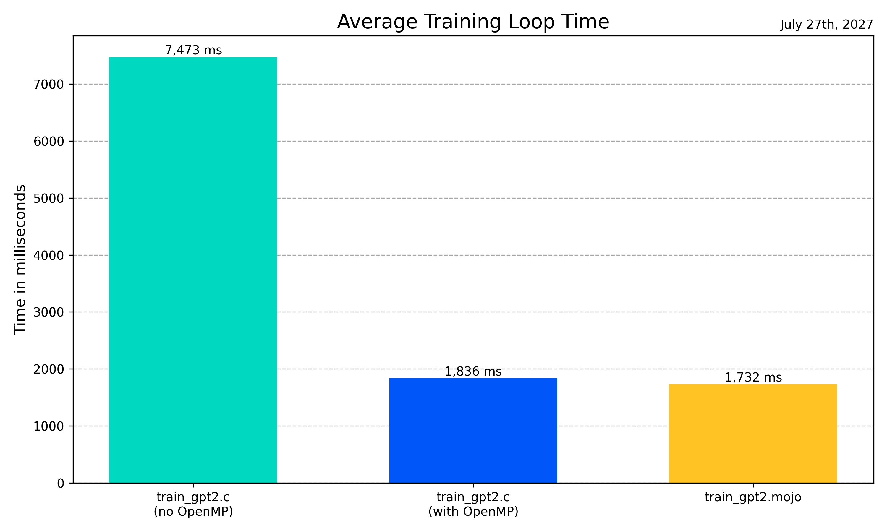

# llm.🔥

This project is a port of Andrej Karpathy's [llm.c](https://github.com/karpathy/llm.c) to [Mojo](https://docs.modular.com/mojo), currently in beta. Visit [llm.c](https://github.com/karpathy/llm.c) for a detailed explanation of the original project.

> **Note**: This project is based on the stable Mojo 25.5 release.

## Prerequisite

Before using llm.🔥 for the first time, please run the following preparatory commands:
  
```bash
pip install -r requirements.txt
python prepro_tinyshakespeare.py  
python train_gpt2.py
```

## How to use

### Step 1: Install Pixi

If you don't have it, install [pixi](https://pixi.sh/latest/):

```bash
curl -fsSL https://pixi.sh/install.sh | sh
```

### Step 2: Run the training program

Start the virtual environment and execute the training program:

```bash
pixi shell
mojo train_gpt2.mojo
```

> **Note**: The first time you run `pixi shell`, it will automatically install all necessary dependencies defined in `pixi.toml`.

For a more detailed step-by-step guide including additional setup details and options, please refer to our [detailed usage instructions](./usage_instructions.md).

## Benchmarks

Basic benchmark results: (M2 MacBook Pro)

- Below are average training loop times, observed across the various implementations. Please note that these results are intended to provide a general comparison rather than precise, repeatable metrics.

- We are running the OpenMP-enabled train_gpt2.c with 64 threads.
  (`OMP_NUM_THREADS=64 ./train_gpt2`)

| Implementation             | Average Training Loop Time |
|----------------------------|----------------------------|
| train_gpt2.mojo            | 1732 ms                    |
| train_gpt2.c (with OpenMP) | 1836 ms                    |
| train_gpt2.c (no OpenMP)   | 7473 ms                    |



## Test

We ported `test_gpt2.c` from the original repository to Mojo to validate our port's functionality. For instructions on how to run this test and insights into the results it yields, please see our guide [here](./test.md).

## Development Roadmap

At this stage, there are no plans for further development of this app. It primarily serves as a proof of concept, showcasing Mojo's ability to implement C-like applications in terms of speed and low-level programming. That said, I’m always open to new ideas or collaboration opportunities, so feel free to reach out to discuss ideas.
  
## Changelog

- 2025.08.05
  - Update to Mojo 25.5
- 2025.07.27
  - Update to Mojo 25.4
- 2024.12.17
  - Update to Mojo 24.6
- 2024.09.27
  - Experimental Mojo 24.5 nightly version
- 2024.09.24
  - Switch to the [Magic](https://docs.modular.com/max/tutorials/magic) package management tool by Modular
- 2024.06.07
  - Update to Mojo 24.4
- 2024.05.04
  - Update to Mojo 24.3
  - Update llm.c changes
- 2024.04.20
  - Further optimization (utilizing unroll_factor of vectorize)
- 2024.04.19
  - test_gpt2.mojo added.
- 2024.04.18
  - Upgraded project status to Beta.
  - Further optimizations of train_gpt2.mojo.
- 2024.04.16
  - Vectorize parameter update
- 2024.04.15
  - Tokenizer Added - `train_gpt2.c` Update 2024.04.14
  - Bug fix `attention_backward`
- 2024.04.13
  - Initial repository setup and first commit.

## License

MIT
