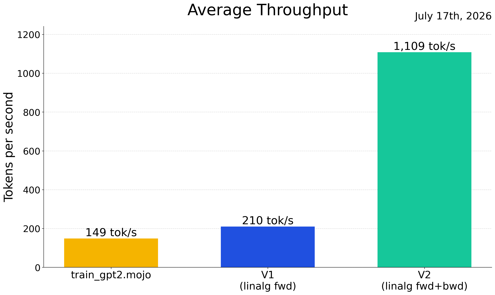

# CPU Variants

We are exploring how far CPU training throughput can be pushed by replacing our
hand-written matmul loops with MAX's `linalg` GEMM kernel (`linalg.matmul`). Each variant is a full copy of `train_gpt2.mojo` with a growing subset of its matmuls swapped, so we can measure what each step buys. All variants are fp32 and produce losses matching the baseline.

## V1 — forward only

`variants/train_gpt2_v1_linalg_fwd.mojo`

Only `matmul_forward` is swapped to `linalg.matmul`; the bias is added in a
separate parallelized pass. Everything else — including the backward pass — is
unchanged from the baseline. This isolates the forward pass's share of the win.

## V2 — forward + backward

`variants/train_gpt2_v2_linalg_fwdbwd.mojo`

Builds on V1 by also rewriting `matmul_backward` on top of `linalg.matmul`: the
input-gradient and weight-gradient matmuls go through the kernel, while the bias
gradient stays hand-written.

## Speed comparison

Same workload for every arm (B=4, T=64, 41 steps, fp32, CPU, `gpt2_124M.bin`
init), averaged over the steady-state steps.

| Variant                    | Average Training Loop Time | Throughput      | Speedup |
|----------------------------|----------------------------|-----------------|---------|
| train_gpt2.mojo (baseline) | 1716 ms                    | 149 tok/s       | 1.00x   |
| V1 — forward only          | 1223 ms                    | 210 tok/s       | 1.41x   |
| V2 — forward + backward    | 232 ms                     | 1109 tok/s      | 7.44x   |

